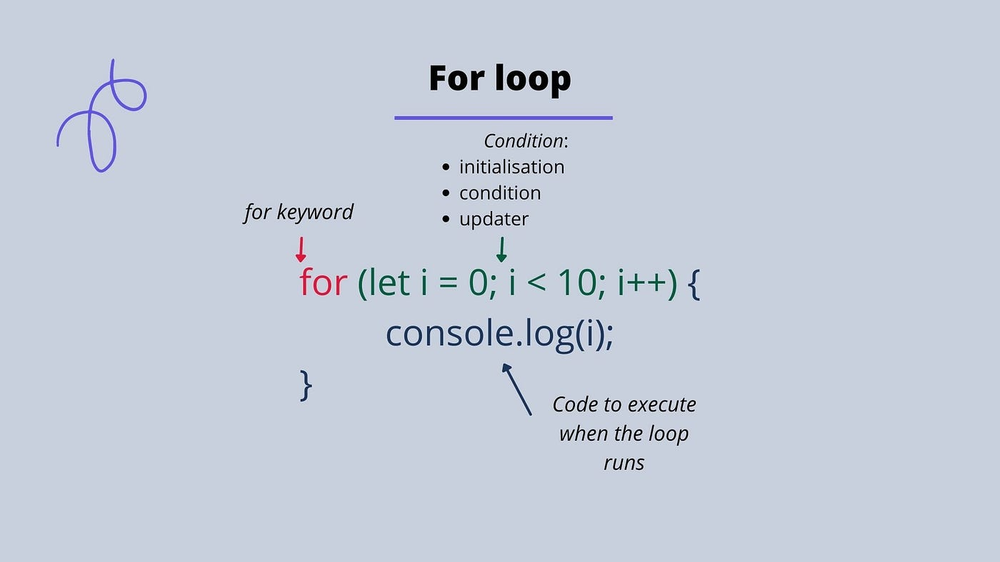

# Loops In Javascript

## Learning Goals

By the end of this lesson we will be able to:

- Define a loop
- Use a `for` loop to repeat a task
- Use a `while` loop to repeat a task
- Use a `do...while` loop to repeat a task
- Use the `break` keyword to exit a loop
- Use the `continue` keyword to skip an iteration

## Introduction

In programming we often need to repeat a task multiple times. For example we might need to print a message 5 times, or we might need to calculate the sum of all numbers in an array.


## What is a Loop?

A loop is a programming construct that allows us to repeat a task multiple times. For example, we can use a loop to print a message 5 times without writing the same code 5 times.

Say we want to print the message `Hello World` 5 times in a row a bad approach would be to write the same code 5 times:

```javascript
console.log("Hello World");
console.log("Hello World");
console.log("Hello World");
console.log("Hello World");
console.log("Hello World");
```

A better approach would be to use a loop:

```javascript
for(let i = 0; i < 5; i++) {
    console.log("Hello World");
}
```

The loop above will print `Hello World` 5 times. Let's break down the loop:

- `let i = 0`: This initializes the loop and sets the starting point.
- `i < 5`: This is the condition that must be true for the loop to run.
- `i++`: This increments the value of `i` each time the loop runs.
- `console.log("Hello World")`: This is the code that will be repeated.
- `for(let i = 0; i < 5; i++)`: This is the loop header. It contains the initialization, condition, and increment.
- `console.log("Hello World")`: This is the loop body. It contains the code that will be repeated.

## `for` Loop



Let's take a closer look at the `for` loop:

In this example we want to print numbers from 0 to 4:

```javascript
for(let i = 0; i < 5; i++) {
    console.log(i);
}
```

The `for` loop has three parts: initialization, condition, and increment. The loop will run as long as the condition is true. Each time the loop runs, the increment will be executed.

### Initialization

The initialization is used to set the starting point of the loop. In the example above, we set the starting point to `0` by writing `let i = 0`. We can use any variable name we want, but `i` is commonly used as it stands for index/iteration.

### Condition

The condition is used to determine whether the loop should run or not. In the example above, we set the condition to `i < 5`. because this condition will be true until `i` is equal to `5`, meaning our `console.log(i)` will run 5 times printing the numbers from `0` to `4`.

### Increment

The increment is used to change the value of the variable each time the loop runs. In the example above, we increment `i` by writing `i++`. This means that `i` will be incremented by `1` each time the loop runs.

### When to Use a `for` Loop

Generally you should use for loop if you know exactly how many iteration you need to do. For example, if you want to print a message 5 times, you know that you need to run the loop 5 times, if you want to sum all numbers in an array, you know that you need to run the loop as many times as the length of the array etc...

## `while` Loop

The `while` loop is similar to the `for` loop, but it only has a condition. The loop will run as long as the condition is true.

Let's take a look at an example:

In this example we want a program that checks our balance and if we have enough money, it will buy a product:

```javascript

let balance = 110;
let price = 50;


while(balance >= price) {
    // print that we bought a product
    console.log("You bought a product");
    // subtract the price from the balance
    balance -= price; // this is the same as balance = balance - price
}

console.log('Balance Left: ' + balance);
```

In the example above, we have a `while` loop that will run as long as the balance is greater than or equal to the price. Each time the loop runs, we print that we bought a product and subtract the price from the balance. When the balance is less than the price, the loop will stop.

### When to Use a `while` Loop

Generally you should use a `while` loop if you don't know how many times the loop should run. For example, if you want to keep asking the user for input until they enter a valid input, you don't know how many times the loop will run.

- Use a `for...in` loop to iterate over an object
- Use a `for...of` loop to iterate over an array attempts.

In this scenario:

Trying to log in represents the action you "do."
Checking if you've exceeded the maximum number of login attempts (or if you decide to quit) represents the "while" condition.

```javascript
const MAX_LOGIN_ATTEMPTS = 3; // This is written in all caps to indicate that it's a constant value that shouldn't be changed.
const userPassword = "1234"; // we got this from our database

let loginAttempts = 0; // we start with 0 login attempts
let enteredPassword = ""; // we start with an empty string

do {
    enteredPassword = prompt("Enter your password:"); // This will pop up a dialog for password input
    loginAttempts++;
    
    if(enteredPassword === userPassword) {
        alert("Login successful!");
        break; // This exits the loop
    } else if(loginAttempts < MAX_LOGIN_ATTEMPTS) {
        alert("Incorrect password. Try again.");
    } else {
        alert("Exceeded maximum attempts. Goodbye.");
    }
    
} while (loginAttempts < MAX_LOGIN_ATTEMPTS && enteredPassword !== userPassword);
```

As you see in this example our loop have to be executed at least once before evaluating the condition. and that is the only difference between `while` and `do...while` loop.

## `break` Keyword

The `break` keyword is used to exit a loop. For example, we can use `break` to exit a loop when a condition is met.

Let's take a look at an example:

In this example let say we want to print every fruit in an array until we find the fruit `Banana`:

```javascript
let fruits = ["Apple", "Banana", "Cherry", "Durian", "Elderberry", "Fig", "Grape"];

for(let i = 0; i < fruits.length; i++) {
    console.log(fruits[i]);
    if(fruits[i] === "Banana") {
        break;
    }
}
```

In the example above, we have a `for` loop that will print every fruit in the array. If the fruit is `Banana`, we will exit the loop using `break`.

## `continue` Keyword

The `continue` keyword is used to skip an iteration. For example, we can use `continue` to skip an iteration when a condition is met.

Let's take a look at an example:

In this example let say we want to print every fruit in an array except `Banana`:

```javascript
let fruits = ["Apple", "Banana", "Cherry", "Durian", "Elderberry", "Fig", "Grape"];

for(let i = 0; i < fruits.length; i++) {
    if(fruits[i] === "Banana") {
        continue;
    }
    console.log(fruits[i]);
}
```

In the example above, we have a `for` loop that will print every fruit in the array except `Banana`. If the fruit is `Banana`, we will skip the iteration using `continue`.

## Summary

In this lesson we learned about loops in JavaScript. We learned about the `for` loop, `while` loop, `do...while` loop, `break` keyword, and `continue` keyword.

## Resources

- [MDN: for](https://developer.mozilla.org/en-US/docs/Web/JavaScript/Reference/Statements/for)
- [MDN: while](https://developer.mozilla.org/en-US/docs/Web/JavaScript/Reference/Statements/while)
- [MDN: do...while](https://developer.mozilla.org/en-US/docs/Web/JavaScript/Reference/Statements/do...while)
- [MDN: break](https://developer.mozilla.org/en-US/docs/Web/JavaScript/Reference/Statements/break)
- [MDN: continue](https://developer.mozilla.org/en-US/docs/Web/JavaScript/Reference/Statements/continue)
- [3WC JavaScript Loops](https://www.w3schools.com/js/js_loop_for.asp)
- [3WC JavaScript Break](https://www.w3schools.com/js/js_break.asp)
- [3WC JavaScript Continue](https://www.w3schools.com/js/js_break.asp)
- [3WC JavaScript While Loop](https://www.w3schools.com/js/js_loop_while.asp)
- [3WC JavaScript Do While Loop](https://www.w3schools.com/js/js_loop_while.asp)


## Video Tutorials

- [Javascript Loops - Mosh](https://www.youtube.com/watch?v=s9wW2PpJsmQ)
